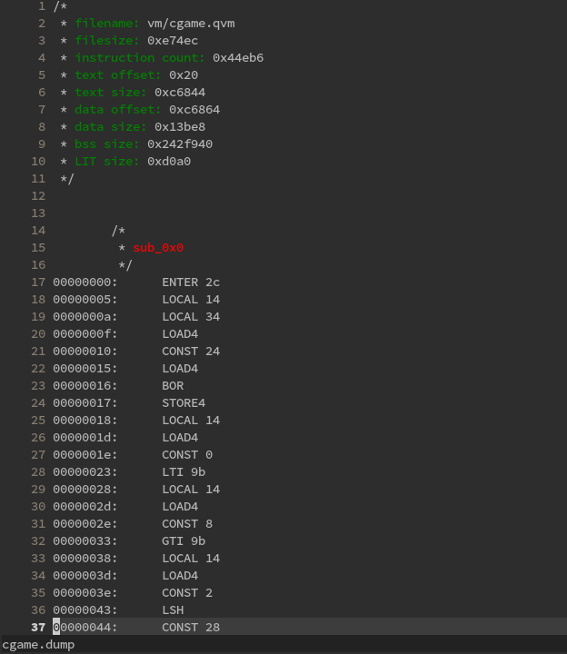

# qd
qd is a simple and fast multi-platform disassembler for the Quake VM.

# Build/Install

```
$ git clone https://github.com/Pr3ach/qd && cd qd && make
```

## Usage
```
qd-1.0/unix built on Nov 30 2020 - by Preacher

Usage: qd <qvm_file>
```

The asm listing outputs to stdout, but you can easily redirect it to a file.
Here's an asm listing from a random qvm, displayed in vim using the [AnsiEsc plugin](http://www.vim.org/scripts/script.php?script_id=302):


